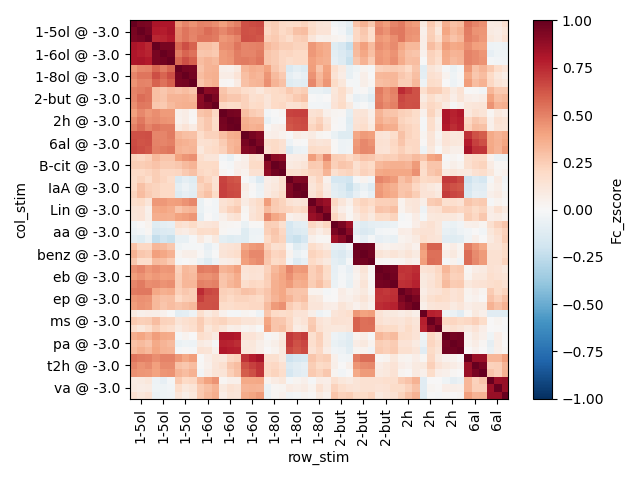

Functions for processing neural timeseries data and performing RSA analysis, using `xarray`.

## Convert `suite2p` outputs into `xarray` Datasets

To convert `suite2p` outputs into an `xr.Dataset` with dimensions `('cells', 'time')`:

```python
from pathlib import Path
import numpy as np
import xarray as xr
import xrsa
import external

stat_file = Path(
        "/local/matrix/Remy-Data/projects/odor_space_collab/processed_data/2022-10-26/2"
        "/megamat1_singleplane/suite2p/plane0/stat.npy")

# %% make cells x time dataset (timeseries)
ds_suite2p_outputs = external.suite2p.convert.outputs_2_xarray_base(stat_file)
```

`ds_suite2p_outputs` should look like this:

```
<xarray.Dataset>
Dimensions:    (cells: 465, time: 30712)
Coordinates:
  * cells      (cells) int64 0 1 2 3 4 5 6 ... 4331 4332 4336 4338 4354 4384
    iscell     (cells) int64 1 1 1 1 1 1 1 1 1 1 1 1 ... 1 1 1 1 1 1 1 1 1 1 1 1
    cellprob   (cells) float64 0.1434 0.9687 0.9865 ... 0.5172 0.001337 0.000503
  * time       (time) float64 2.892 2.942 2.992 ... 1.534e+03 1.534e+03
Data variables:
    Fc         (cells, time) float32 148.8 260.6 261.4 ... 123.9 106.1 117.5
    F          (cells, time) float32 148.8 260.6 261.4 ... 123.9 106.1 117.5
    Fneu       (cells, time) float32 0.0 0.0 0.0 0.0 0.0 ... 0.0 0.0 0.0 0.0 0.0
    spks       (cells, time) float32 0.0 106.8 0.0 0.0 ... 0.0 4.59 0.0 3.802
    F_zscore   (cells, time) float32 -0.1931 1.918 1.934 ... 0.02367 0.9307
    Fc_zscore  (cells, time) float32 -0.1931 1.918 1.934 ... 0.02367 0.9307
```

### Timestamps

To add timestamps to `ds_suite2p_outputs`, use the function `xrsa.timestamps.add_timestamps_to_suite2p_outputs`

```python
# stack_times should be a 1-D numpy array, with the same number of elements as ds_suite2p_outputs.time
ds_suite2p_outputs = xrsa.timeseries.add_timestamps_to_suite2p_outputs(
        ds_suite2p_outputs, timestamps=stack_times)
```

To drop cells where `iscell != 0`,

```python
# drop cells where `iscell=0`
ds_suite2p_outputs = ds_suite2p_outputs.where(ds_suite2p_outputs.iscell == 1, drop=True)
```

## Trials

### Convert `xr.Dataset` timeseries to trial-structured `xr.Dataset`

To convert `ds_suite2p_outputs` into a dataset with dimensions `('trials', 'cells', 'time')`, you need a stimulus
onset times (`stim_ict`) and a list of stimulus IDs (`stim_list`).

`stim_ict` and `stim_list` should be the same length.

```python
# olf_ict : 1-D numpy array of stimulus onset times
# stim_list: list of stimulus identifier strings; I use things like '1-6ol @ -3.0'
# trial_ts: timestamps to sample relative to `olf_ict` times; for a (-5, 20) time window sampled at every 0.05 
#            seconds, where stimulus onset occurts at time 0, use np.arange(-5, 20, 0.05).round(3)
# index_stimuli: whether to include additional stimulus grouping indices (computed using `stim_list`)

ds_trials = xrsa.trials.timeseries_2_trials(ds_suite2p_outputs,
                                            stim_ict=acq.timestamps['olf_ict'],
                                            stim_list=acq.stim_list,
                                            trial_ts=np.arange(-5, 20, 0.05).round(3),
                                            index_stimuli=False,
                                            )
```

`ds_trials` should look something like this:

```
<xarray.Dataset>
Dimensions:    (trials: 51, cells: 465, time: 500)
Coordinates:
  * cells      (cells) int64 0 1 2 3 4 5 6 ... 4331 4332 4336 4338 4354 4384
    iscell     (cells) int64 1 1 1 1 1 1 1 1 1 1 1 1 ... 1 1 1 1 1 1 1 1 1 1 1 1
    cellprob   (cells) float64 0.1434 0.9687 0.9865 ... 0.5172 0.001337 0.000503
  * time       (time) float64 -5.0 -4.95 -4.9 -4.85 ... 19.8 19.85 19.9 19.95
  * trials     (trials) int64 0 1 2 3 4 5 6 7 8 9 ... 42 43 44 45 46 47 48 49 50
    stim       (trials) <U12 'ep @ -3.0' 'ep @ -3.0' ... 'benz @ -3.0'
Data variables:
    Fc         (trials, cells, time) float64 289.3 316.1 299.5 ... 88.75 90.05
    F          (trials, cells, time) float64 289.3 316.1 299.5 ... 88.75 90.05
    Fneu       (trials, cells, time) float64 0.0 0.0 0.0 0.0 ... 0.0 0.0 0.0 0.0
    spks       (trials, cells, time) float64 5.088 0.0 0.0 0.0 ... 0.0 0.0 1.822
    F_zscore   (trials, cells, time) float64 2.46 2.966 2.654 ... -1.359 -1.255
    Fc_zscore  (trials, cells, time) float64 2.46 2.966 2.654 ... -1.359 -1.255
Attributes:
    trials.stim_ict:   [9.803833333333333, 39.8236, 69.8433, 99.8630333333333...
    trials.stim_list:  ['ep @ -3.0', 'ep @ -3.0', 'ep @ -3.0', 'Lin @ -3.0', ...

```

### Baseline correction

Baseline subtraction on the trial traces is performed using `xrsa.trials.baseline_correct_trials`.

- `baseline_win` is the time window (relative to stimulus onset) to use as baseline. The value will depend on the
stimulus delivery trial structure used when imaging, and `trial_ts` you used in `xrsa.trials.timeseries_2_trials`.
    - When performing baseline subtraction on PN bouton movies, where stimuli are delivered every 30 seconds, I use the
5-second window before stimulus onset as baseline (`baseline_win=(-5, 0)`). For KC soma acquisitions, where stimuli
are delivered every 60 seconds, I use `baseline_win=(-10, 0)`.

- `baseline_method` should depend on the cell population and calcium indicator used when imaging. When imaging KC
soma expressing nuclear GCaMP, I use `baseline_method='mean'`. When imaging PN boutons or KC claws expressing GCaMP8m (
which have more spontaneous activity than KC soma), I use`baseline_method='quantile'`.

- When `baseline_method='quantile'`, `baseline_quantile` of the activity during `baseline_win` is computed and 
subtracted off from the rest of the trial trace on a cell-by-cell basis. If `baseline_method='mean'`, then 
`baseline_method` is ignored.  

Example baseline correction of PN bouton trial traces:
```python
# baseline-correct traces
#   for PN boutons/KC claws, use baseline_method='quantile')
#   for KC soma, use baseline_method = 'mean', baseline_quantile is ignored

ds_bc_trials = xrsa.trials.baseline_correct_trials(ds_trials,
                                                   baseline_win=(-5, 0),
                                                   baseline_method='quantile',
                                                   baseline_quantile=0.5
                                                   )
```
Example baseline correction of KC soma trial traces:
```python
# baseline-correct traces
#   for PN boutons/KC claws, use baseline_method='quantile')
#   for KC soma, use baseline_method = 'mean', baseline_quantile is ignored

ds_bc_trials = xrsa.trials.baseline_correct_trials(ds_trials,
                                                   baseline_win=(-10, 0),
                                                   baseline_method='mean',
                                                   )
```

`ds_bc_trials` should look something like this, with baseline subtraction parameters added to `attrs`:
```<xarray.Dataset>
<xarray.Dataset>
Dimensions:    (cells: 465, time: 500, trials: 51)
Coordinates:
  * cells      (cells) int64 0 1 2 3 4 5 6 ... 4331 4332 4336 4338 4354 4384
    iscell     (cells) int64 1 1 1 1 1 1 1 1 1 1 1 1 ... 1 1 1 1 1 1 1 1 1 1 1 1
    cellprob   (cells) float64 0.1434 0.9687 0.9865 ... 0.5172 0.001337 0.000503
  * time       (time) float64 -5.0 -4.95 -4.9 -4.85 ... 19.8 19.85 19.9 19.95
  * trials     (trials) int64 0 1 2 3 4 5 6 7 8 9 ... 42 43 44 45 46 47 48 49 50
    stim       (trials) <U12 'ep @ -3.0' 'ep @ -3.0' ... 'benz @ -3.0'
Data variables:
    Fc         (trials, cells, time) float64 121.8 148.6 132.1 ... -13.8 -12.5
    F          (trials, cells, time) float64 121.8 148.6 132.1 ... -13.8 -12.5
    Fneu       (trials, cells, time) float64 0.0 0.0 0.0 0.0 ... 0.0 0.0 0.0 0.0
    spks       (trials, cells, time) float64 5.088 0.0 0.0 0.0 ... 0.0 0.0 1.822
    F_zscore   (trials, cells, time) float64 2.301 2.806 2.494 ... -1.1 -0.996
    Fc_zscore  (trials, cells, time) float64 2.301 2.806 2.494 ... -1.1 -0.996
Attributes:
    trials.stim_ict:             [9.803833333333333, 39.8236, 69.8433, 99.863...
    trials.stim_list:            ['ep @ -3.0', 'ep @ -3.0', 'ep @ -3.0', 'Lin...
    baseline.baseline_win:       (-5, 0)
    baseline.baseline_method:    quantile
    baseline.baseline_quantile:  0.5
```
## Trial response vectors 
Peak amplitudes can be computed from `ds_trials` or `ds_bc_trials` with the following: 
```python
subtract_baseline_mean = True

if subtract_baseline_mean:
  # compute the peak amplitube with the baseline average subtracted
    ds_mean_peak = ds_bc_trials.sel(time=slice(0, 3)).mean(dim='time') - ds_bc_trials.sel(time=slice(-5, 0)).mean
  (dim='time')
else:
  # compute the peak amplitude as the average during the expected peak response time window
    ds_mean_peak = ds_bc_trials.sel(time=slice(0, 3)).mean(dim='time')
```
`ds_mean_peak` should have dims `('cells', 'trials')` and look something like this:
```
<xarray.Dataset>
Dimensions:    (cells: 465, trials: 51)
Coordinates:
  * cells      (cells) int64 0 1 2 3 4 5 6 ... 4331 4332 4336 4338 4354 4384
    iscell     (cells) int64 1 1 1 1 1 1 1 1 1 1 1 1 ... 1 1 1 1 1 1 1 1 1 1 1 1
    cellprob   (cells) float64 0.1434 0.9687 0.9865 ... 0.5172 0.001337 0.000503
  * trials     (trials) object MultiIndex
  * stim       (trials) <U12 'ep @ -3.0' 'ep @ -3.0' ... 'benz @ -3.0'
  * stim_occ   (trials) int64 0 1 2 0 1 2 0 1 2 0 1 2 ... 1 2 0 1 2 0 1 2 0 1 2
  * trial_idx  (trials) int64 0 1 2 3 4 5 6 7 8 9 ... 42 43 44 45 46 47 48 49 50
Data variables:
    Fc         (trials, cells) float64 240.6 473.2 183.8 ... 75.04 4.985 20.49
    F          (trials, cells) float64 240.6 473.2 183.8 ... 75.04 4.985 20.49
    Fneu       (trials, cells) float64 0.0 0.0 0.0 0.0 0.0 ... 0.0 0.0 0.0 0.0
    spks       (trials, cells) float64 15.81 31.03 8.471 ... 4.404 0.3933 1.205
    F_zscore   (trials, cells) float64 4.543 4.17 3.805 ... 1.374 0.7713 1.633
    Fc_zscore  (trials, cells) float64 4.543 4.17 3.805 ... 1.374 0.7713 1.633
Attributes:
    trials.stim_ict:             [9.803833333333333, 39.8236, 69.8433, 99.863...
    trials.stim_list:            ['ep @ -3.0', 'ep @ -3.0', 'ep @ -3.0', 'Lin...
    baseline.baseline_win:       (-5, 0)
    baseline.baseline_method:    quantile
    baseline.baseline_quantile:  0.5
```
### Stimulus-averaged peak amplitudes
To compute the stimulus-averaged peak amplitudes,
```python
ds_stimvag_mean_peak = ds_mean_peak.groupby('stim').mean('trials')
```

`ds_stimavg_mean_peak` should have dims `('cells', 'stim')`, and look something like this:
```
<xarray.Dataset>
Dimensions:    (cells: 465, stim: 17)
Coordinates:
  * cells      (cells) int64 0 1 2 3 4 5 6 ... 4331 4332 4336 4338 4354 4384
    iscell     (cells) int64 1 1 1 1 1 1 1 1 1 1 1 1 ... 1 1 1 1 1 1 1 1 1 1 1 1
    cellprob   (cells) float64 0.1434 0.9687 0.9865 ... 0.5172 0.001337 0.000503
  * stim       (stim) object '1-5ol @ -3.0' '1-6ol @ -3.0' ... 'va @ -3.0'
Data variables:
    Fc         (stim, cells) float64 88.12 167.3 37.37 ... 24.76 4.441 8.384
    F          (stim, cells) float64 88.12 167.3 37.37 ... 24.76 4.441 8.384
    Fneu       (stim, cells) float64 0.0 0.0 0.0 0.0 0.0 ... 0.0 0.0 0.0 0.0 0.0
    spks       (stim, cells) float64 4.307 7.948 1.392 ... 0.9669 0.1952 0.3764
    F_zscore   (stim, cells) float64 1.664 1.474 0.7737 ... 0.4532 0.6871 0.6682
    Fc_zscore  (stim, cells) float64 1.664 1.474 0.7737 ... 0.4532 0.6871 0.6682
Attributes:
    trials.stim_ict:             [9.803833333333333, 39.8236, 69.8433, 99.863...
    trials.stim_list:            ['ep @ -3.0', 'ep @ -3.0', 'ep @ -3.0', 'Lin...
    baseline.baseline_win:       (-5, 0)
    baseline.baseline_method:    quantile
    baseline.baseline_quantile:  0.5
```

## RSA
To compute an RDM, use `xrsa.rdm.compute_trial_respvec_rdm`.

RDMs can be computed on `ds_trials` (`('trials', 'cells', 'time)`) or `ds_respvec` (`('cells', 'trials)`)

---

### `ds_trials`
`('trials', 'cells', 'time') --> ('time', 'trial_row', 'trial_col')`

```python
ds_rdm_ts = xrsa.rdm.compute_trial_respvec_rdm(ds_bc_trials, 
                                               metric='correlation')
```
`ds_rdm_ts` will have dims `('time', 'trial_row', 'trial_col')` and look something like this:
```
<xarray.Dataset>
Dimensions:        (time: 500, trial_row: 51, trial_col: 51)
Coordinates:
  * time           (time) float64 -5.0 -4.95 -4.9 -4.85 ... 19.85 19.9 19.95
  * trial_row      (trial_row) object MultiIndex
  * row_stim       (trial_row) <U12 'ep @ -3.0' 'ep @ -3.0' ... 'benz @ -3.0'
  * row_stim_occ   (trial_row) int64 0 1 2 0 1 2 0 1 2 0 ... 2 0 1 2 0 1 2 0 1 2
  * row_trial_idx  (trial_row) int64 0 1 2 3 4 5 6 7 ... 43 44 45 46 47 48 49 50
  * trial_col      (trial_col) object MultiIndex
  * col_stim       (trial_col) <U12 'ep @ -3.0' 'ep @ -3.0' ... 'benz @ -3.0'
  * col_stim_occ   (trial_col) int64 0 1 2 0 1 2 0 1 2 0 ... 2 0 1 2 0 1 2 0 1 2
  * col_trial_idx  (trial_col) int64 0 1 2 3 4 5 6 7 ... 43 44 45 46 47 48 49 50
Data variables:
    Fc             (time, trial_row, trial_col) float64 0.0 0.5505 ... 1.472 0.0
    F              (time, trial_row, trial_col) float64 0.0 0.5505 ... 1.472 0.0
    Fneu           (time, trial_row, trial_col) float64 0.0 nan nan ... nan 0.0
    spks           (time, trial_row, trial_col) float64 0.0 0.5924 ... 0.0
    F_zscore       (time, trial_row, trial_col) float64 0.0 1.095 ... 1.247 0.0
    Fc_zscore      (time, trial_row, trial_col) float64 0.0 1.095 ... 1.247 0.0
Attributes:
    trials.stim_ict:             [9.803833333333333, 39.8236, 69.8433, 99.863...
    trials.stim_list:            ['ep @ -3.0', 'ep @ -3.0', 'ep @ -3.0', 'Lin...
    baseline.baseline_win:       (-5, 0)
    baseline.baseline_method:    quantile
    baseline.baseline_quantile:  0.5
    distance_metric:             correlation
```

---
### `ds_mean_peak`
```python
ds_rdm = xrsa.rdm.compute_trial_respvec_rdm(ds_mean_peak, 
                                            metric='correlation')

```
`ds_rdm` will have dims ('trial_row', 'trial_col'), and look something like this:

```<xarray.Dataset>
Dimensions:        (trial_row: 51, trial_col: 51)
Coordinates:
  * trial_row      (trial_row) object MultiIndex
  * row_stim       (trial_row) <U12 'ep @ -3.0' 'ep @ -3.0' ... 'benz @ -3.0'
  * row_stim_occ   (trial_row) int64 0 1 2 0 1 2 0 1 2 0 ... 2 0 1 2 0 1 2 0 1 2
  * row_trial_idx  (trial_row) int64 0 1 2 3 4 5 6 7 ... 43 44 45 46 47 48 49 50
  * trial_col      (trial_col) object MultiIndex
  * col_stim       (trial_col) <U12 'ep @ -3.0' 'ep @ -3.0' ... 'benz @ -3.0'
  * col_stim_occ   (trial_col) int64 0 1 2 0 1 2 0 1 2 0 ... 2 0 1 2 0 1 2 0 1 2
  * col_trial_idx  (trial_col) int64 0 1 2 3 4 5 6 7 ... 43 44 45 46 47 48 49 50
Data variables:
    Fc             (trial_row, trial_col) float64 0.0 0.06798 ... 0.03568 0.0
    F              (trial_row, trial_col) float64 0.0 0.06798 ... 0.03568 0.0
    Fneu           (trial_row, trial_col) float64 0.0 nan nan ... nan nan 0.0
    spks           (trial_row, trial_col) float64 0.0 0.06101 ... 0.02793 0.0
    F_zscore       (trial_row, trial_col) float64 0.0 0.06141 ... 0.03852 0.0
    Fc_zscore      (trial_row, trial_col) float64 0.0 0.06141 ... 0.03852 0.0
Attributes:
    trials.stim_ict:             [9.803833333333333, 39.8236, 69.8433, 99.863...
    trials.stim_list:            ['ep @ -3.0', 'ep @ -3.0', 'ep @ -3.0', 'Lin...
    baseline.baseline_win:       (-5, 0)
    baseline.baseline_method:    quantile
    baseline.baseline_quantile:  0.5
    distance_metric:             correlation
```
## Visualization
### RDM heatmap


To plot an RDM heatmap with trials reordered to group stimuli,

```python
# sort trials
ds_rdm_sorted = ds_rdm_sorted.sortby(['row_stim', 'col_stim'])

fig, ax = plt.subplots(1, 1)
da_rsm = 1 - ds_rdm_sorted['Fc_zscore']
img_rdm = da_rsm.plot.imshow(
        x='row_stim',
        y='col_stim',
        cmap='RdBu_r',
        vmin=-1,
        vmax=1,
        center=0,
        yincrease=False,
        xticks=list(range(1, 51, 3)),
        yticks=list(range(1, 51, 3)),
        ax=ax
        )

new_xticklabels = [label.get_text().split(' @ ')[0] for label in img_rdm.axes.get_xticklabels()]
img_rdm.axes.set_xticklabels(new_xticklabels,
                             rotation=90
                             )
img_rdm.axes.set_box_aspect(1)

plt.tight_layout()
plt.show()
```
#### Custom stimulus order
To use a custom stimulus order, use the following function to reorder trials:
```python
kc_odor_ord = ['2h', 'IaA', 'pa', '2-but', 'eb', 'ep', 'aa', 'va', 'B-cit', 'Lin', '6al', 't2h',
               '1-8ol', '1-5ol', '1-6ol', 'benz', 'ms']

kc_stim_ord = [f"{item} @ -3.0" for item in kc_odor_ord]


def sort_by_row_and_col_stim(ds_rdm_, stim_ord_):
    row_stim_idx = np.argsort([stim_ord_.index(item) for item in ds_rdm_.row_stim.to_numpy()])
    col_stim_idx = np.argsort([stim_ord_.index(item) for item in ds_rdm_.col_stim.to_numpy()])

    return (ds_rdm_
            .isel(trial_row=row_stim_idx, trial_col=col_stim_idx)
            .reset_index(['trial_row', 'trial_col'], drop=True))
```


